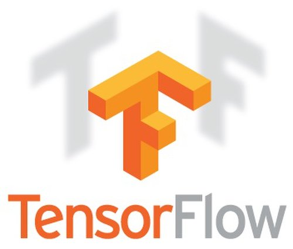

Welcome to the Tensorflow tutorial series. In this tutorial I have talked about how to get started with Tensorflow if you know python atleast
### What is Tensorflow ?
Tensorflow is the open sourse deep learning library contributed by Google . It is a high performation numerical computation library. Its flexible architecture allows easy deployment of computation across a variety of platforms CPUs, GPUs, TPUs, and from desktops to clusters of servers to mobile and edge devices. If you are a data science enthusiast.
